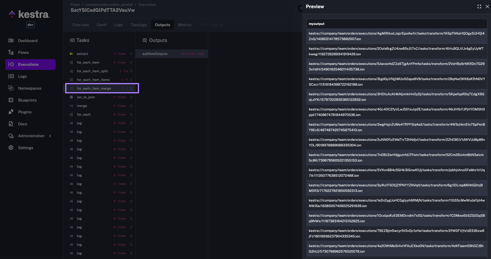
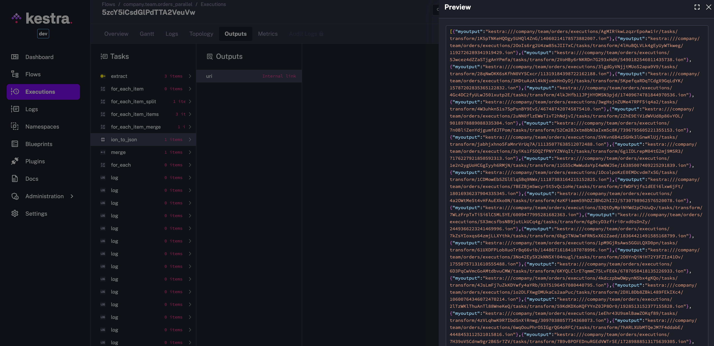

The file [orders_parallel](0_orders_parallel.yaml) will have the following outputs:

But then looping across the output files from subflow executions would lead to the error:

`Unable to read the file 'kestra:///company/team/orders/executions/vBBGnSRLntC6xhA1IjFYc/tasks/transform/541J75lWtI0WQUvxz4v0qH/8580806061061976640.ion' as it didn't belong to the current execution`

